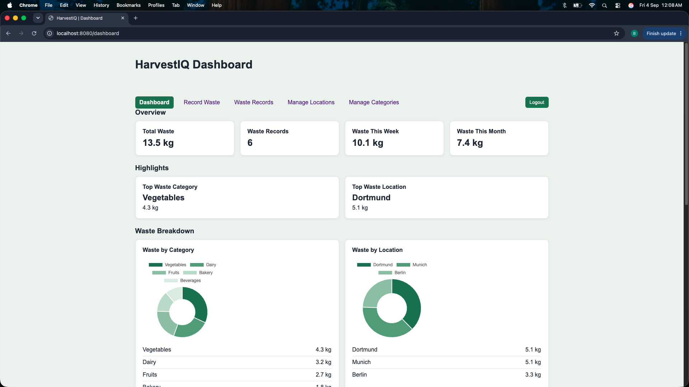
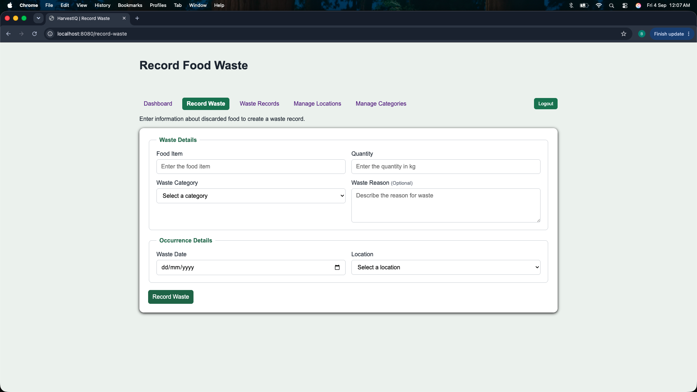
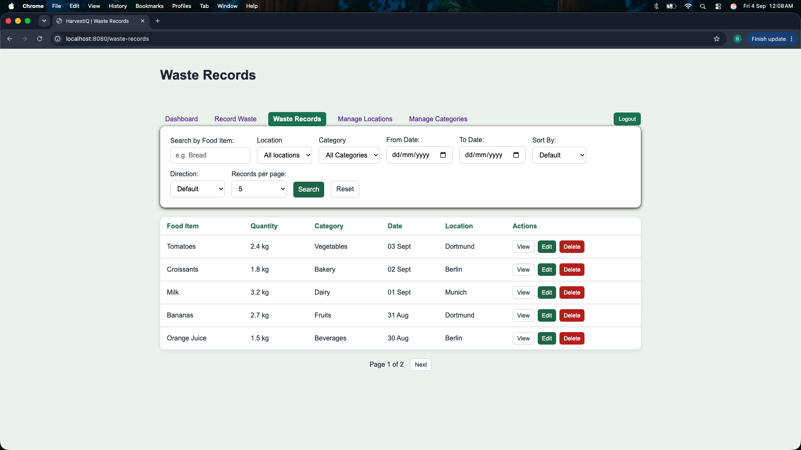
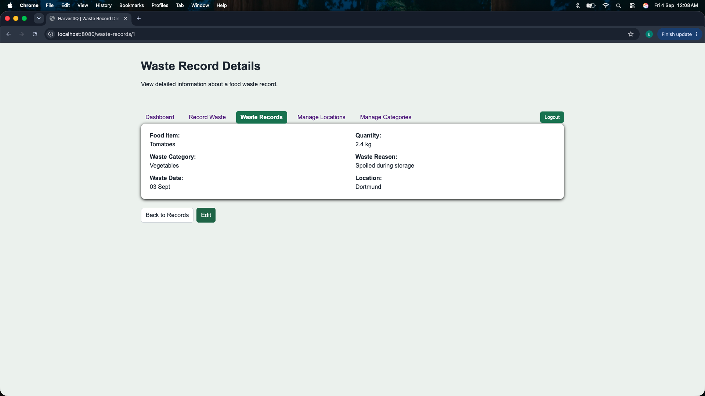
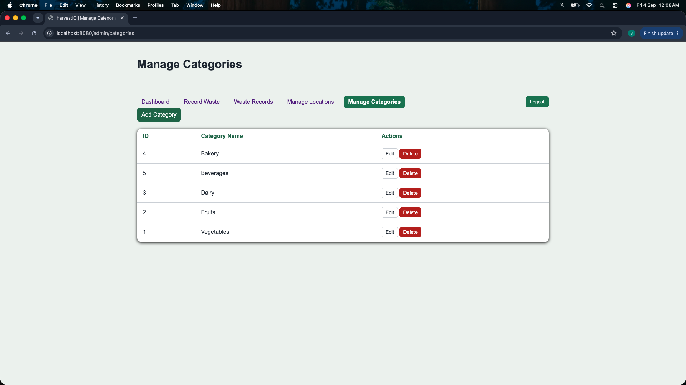

# HarvestIQ

HarvestIQ is a food waste tracking and analytics web application designed to help restaurants record, monitor, and understand food waste across multiple locations.

The application allows staff to record food waste, search and manage waste records, and view waste trends through an analytics dashboard. Administrators can also manage restaurant locations and waste categories.

## Features

- Record food waste with quantity, category, reason, date, and location
- View, edit, and delete waste records
- Search and filter records by food item, location, category, and date range
- Sort records and navigate results using pagination
- Analytics dashboard with:
  - Total waste quantity
  - Total number of waste records
  - Weekly and monthly waste
  - Top waste category
  - Top waste location
  - Waste breakdown by category and location
  - Daily waste trend
- Role-based authentication for Staff and Admin users
- Admin management of waste categories and restaurant locations
- Form validation and duplicate category/location prevention
- Responsive interface for desktop and smaller screens

## Screenshots

### Analytics Dashboard

The dashboard provides an overview of food waste metrics, category and location breakdowns, and waste trends.



### Record Food Waste

Staff can record discarded food along with its quantity, category, reason, date, and restaurant location.



### Waste Records

Records can be searched, filtered, sorted, paginated, viewed, edited, and deleted.



### Waste Record Details

Individual waste records can be viewed in detail and edited when necessary.



### Category Management

Administrators can add, edit, and delete waste categories used when recording food waste.




## Tech Stack

### Backend
- Java
- Spring Boot
- Spring MVC
- Spring Data JPA
- Spring Security
- Bean Validation

### Frontend
- Thymeleaf
- HTML
- CSS
- JavaScript
- Chart.js

### Database
- H2 Database

### Build & Development
- Maven
- Git
- VS Code


## Architecture

HarvestIQ follows a layered architecture:

**Controller → Service → Repository → Database**

- **Controller** handles HTTP requests and prepares data for Thymeleaf views.
- **Service** contains application and business logic.
- **Repository** handles database access using Spring Data JPA.
- **Entity models** represent persistent application data.
- **DTOs** are used for aggregated dashboard analytics.
- **Specifications** provide dynamic filtering of waste records.


## User Roles

HarvestIQ uses role-based access control with two user roles:

- **Staff** – can record food waste, view and manage waste records, and access the analytics dashboard.
- **Admin** – has access to the standard application features along with category and restaurant location management.

Authentication and authorization are implemented using Spring Security, with passwords stored using BCrypt hashing.


## Database

HarvestIQ currently uses an in-memory H2 database for development.

The database is recreated when the application restarts. Default restaurant locations, waste categories, and demo users are initialized automatically when the application starts.


## Key Concepts Implemented

- Layered Spring Boot architecture
- CRUD operations using Spring Data JPA
- Entity relationships with JPA
- Dynamic filtering using Spring Data Specifications
- Pagination and sorting
- JPQL aggregate queries and DTO projections
- Form validation using Bean Validation
- Role-based authentication and authorization
- BCrypt password encoding
- Thymeleaf server-side rendering
- Dashboard visualization using Chart.js
- Responsive UI design

## Running Locally

### Prerequisites

Make sure you have the following installed:

- Java 21
- Git

The project includes the Maven Wrapper, so Maven does not need to be installed separately.

### 1. Clone the repository

```bash
git clone https://github.com/Bhavana-S28/harvestiq.git
```

```bash
cd harvestiq
```

### 2. Set the demo user passwords

HarvestIQ uses environment variables for the default Admin and Staff passwords.

On macOS/Linux:

```bash
export HARVESTIQ_ADMIN_PASSWORD="your-admin-password"
export HARVESTIQ_STAFF_PASSWORD="your-staff-password"
```

### 3. Run the application

```bash
./mvnw spring-boot:run
```

### 4. Open the application

Open the application in your browser at:

`http://localhost:8080`

### Demo Users

**Admin**

- Email: `admin@harvestiq.com`
- Password: the value set in `HARVESTIQ_ADMIN_PASSWORD`

**Staff**

- Email: `staff@harvestiq.com`
- Password: the value set in `HARVESTIQ_STAFF_PASSWORD`

> The application currently uses an in-memory H2 database for development, so application data is reset when the server restarts.